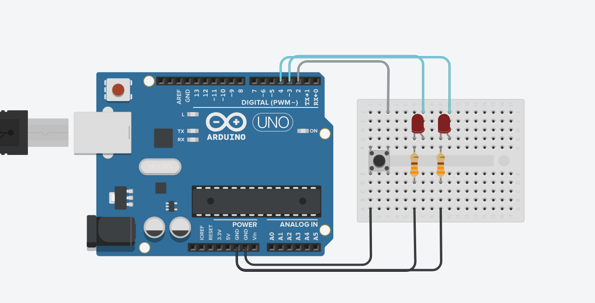

# SIMPLE INTERRUPTION

## Description
Developted an Arduino project to simulate a car directions control.

 - Simulated the ***foward, reverse, turn left*** and ***turn right*** functions.
 - Controled by the **Serial Monitor**.

---

## Circuits Connections

 - The **GND** is connected to the **Terminal 1** of the *Push Button*.
 - The **GND** is connected to the **Cathode** of the *LEDs*
 > Use a resistor between the LEDs and **GND** to be sure your LED is safe of any risk.



 - Pin **3** as **OUTPUT**, connected to the **Anode** of the *LED 1*
 - Pin **4** as **OUTPUT**, connected to the **Anode** of the *LED 2*
 - Pin **2** as **INPUT_PULLUP**, connected to the **Terminal 2** of the *Push Button*

```C++
    pinMode(3, OUTPUT);
    pinMode(4, OUTPUT);
    pinMode(2, INPUT_PULLUP);
```
 - The Pin **2** should be defined as the interruption too.

```C++
    attachInterrupt(digitalPinToInterrupt(2),BOTON,RISING); 
```

---
## Usage
To make use of this repository correctly, follow the next steps.

1. First of all you would need to clone this repository, in the terminal put the next code to clone this repository:

```sh
    git clone https://github.com/Rafael-Anguiano/Simple-Interruption.git
    cd Simple-Interruption/
```

2. Make the connections shown [above](#Circuits-Connections)

3. Once you have made the connections, you need to open the [Test.ino](./Test.ino) code in an **Arduino Simulator** or an **Arduino IDE** 
4. Upload the code to your Arduino and you would be ready to go.

> 5. In the *Serial Monitor* you can see how the counter is going up every time you press the push button.

> 6. The LEDs will shine if the counter is pair. Otherwise they will be turned off.

---

## Developed By:
 Rafael de Jesús Anguiano Suárez del Real (March 2021)